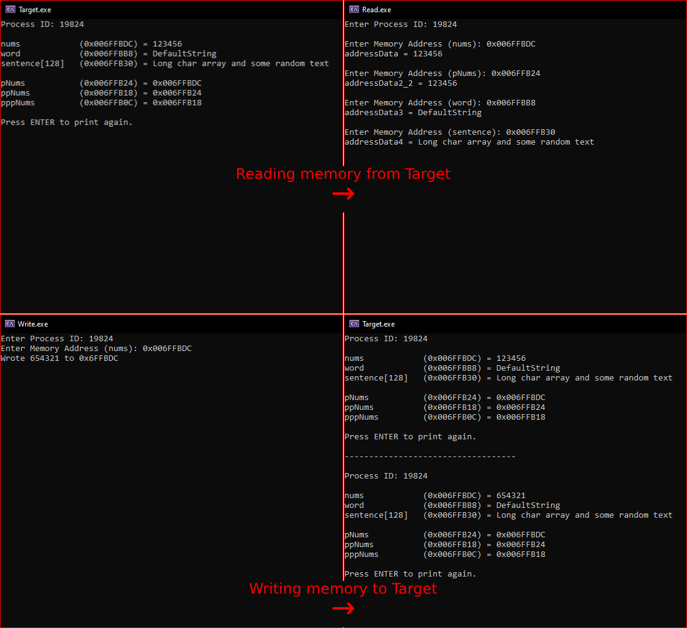

# 🧠 C++ Memory Manipulation Suite
**C++ Memory Manipulation Suite** is a collection of applications designed to practice reading and writing memory in C++. This suite includes three main components that facilitate hands-on experience with memory manipulation concepts.

## 📋 Features
- **🎯 Target Program**  
  Displays objects and pointers along with their memory addresses and the data stored at those addresses, providing a clear view of the memory layout.

- **📖 Read Program**  
  Reads from the target program and outputs the data stored at a specified memory address, allowing users to see how data is accessed in memory.

- **✏️ Write Program**  
  Writes to a specified memory address in the target program, demonstrating how data can be modified in memory directly.
